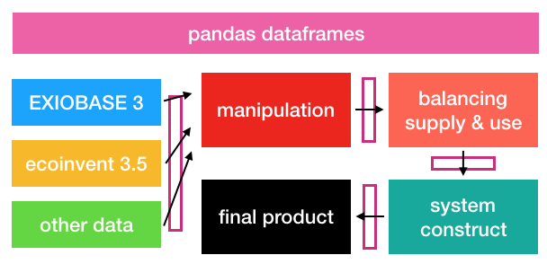

.. ensemble documentation master file, created by
   sphinx-quickstart on Wed Sep 19 11:00:53 2018.
   You can adapt this file completely to your liking, but it should at least
   contain the root `toctree` directive.

ensemble hybrid LCI creator
===========================

ensemble is a Python library for creating hybrid life cycle inventory (LCI) databases, using scientific principles instead of ad hoc manual choices. It is currently under development, and therefore doesn't have anything particularly good for the time being - we are just trying to get the basic sums right to be able to export a database that can be used for calculations.

The basic workflow is:

.. toctree::
   :maxdepth: 2
   :caption: Contents:

Indices and tables
==================

* :ref:`genindex`
* :ref:`modindex`
* :ref:`search`
